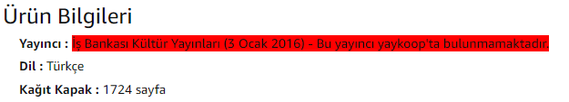

# What is the Yaykoop extension doing?

- This extension **DOESN'T copy or take your data**.
- The extension goes in the HTML selector direction of the address and gets the publisher data.
- Then extension compares the publisher data with yaykoop publisher data.

> If Yaykoop finds the publisher inside the www.yaykoop.com

> If Yaykoop doesn't find the publisher inside the www.yaykoop.com

## Features

- Use npm dependencies thanks to [Parcel 2].
- Use yarn for building an encrypted and integrated structure.

## How to use this template

Click [<kbd>Use this template</kbd>](https://github.com/canozmen/yaykoop-bext-v2/generate) and make a copy of your own. 😉

## Configuration

- content.js is the main javascript file that runs on each page load.
- yaykoop.js has functions and the data about websites, websites pointers and publisher names inside of it.
- background.js connects imports to each other because the content script can't import modules otherwise.
- manifest.json has extension's information and websites links.
- icon.png is extension's picture.
- When you change the extension javascript files you have to build with yarn library and add to extensions site.

### Parcel2

Being based on Parcel 2 and its [WebExtension transformer](https://v2.parceljs.org/recipes/web-extension/), you get all the good parts:

- Browserlist-based code transpiling (which defaults to just the latest Chrome and Firefox versions)
- Automatically picks up any new file specified in `manifest.json`
- Adding TypeScript support is as easy as renaming your files to `.ts`; [sindresorhus/tsconfig][link-tsconfig] is also advised in that case.

## Examples

### idefix: 
[Dune Tanrı İmparatoru](https://www.idefix.com/Kitap/Dune-Tanri-Imparatoru-Clz/Edebiyat/Roman/Bilim-Kurgu/urunno=0001723185001)

[Yarınlar Bizimdir Yoldaşlar](https://www.idefix.com/Kitap/Yarinlar-Bizimdir-Yoldaslar/Manuel-Tiago/Edebiyat/Roman/Dunya-Roman/urunno=0000000258615)

[Küllerin Günü](https://www.idefix.com/Kitap/Kullerin-Gunu/Edebiyat/Roman/Polisiye/urunno=0001910489001)

### amazon: 
[Dune Tanrı İmparatoru](https://www.amazon.com.tr/Dune-Tanr%C4%B1-%C4%B0mparatoru-Frank-Herbert/dp/6053757209/ref=sr_1_1?__mk_tr_TR=%C3%85M%C3%85%C5%BD%C3%95%C3%91&crid=1413VYJEOU1WL&dchild=1&keywords=dune+tanr%C4%B1+imparatoru&qid=1616684043&sprefix=Dune+tanr%C4%B1%2Caps%2C210&sr=8-1)

[Sefiller](https://www.amazon.com.tr/Sefiller-Kitap-Tak%C4%B1m-Victor-Hugo/dp/6053324744/ref=sr_1_1?__mk_tr_TR=%C3%85M%C3%85%C5%BD%C3%95%C3%91&crid=38DPWSKK80DFR&dchild=1&keywords=kitap&qid=1617179051&sprefix=kita%2Caps%2C219&sr=8-1)

 ### d&r: 
[İthaki Bilimkurgu Ajandası](https://www.dr.com.tr/Kirtasiye/Ithaki-Bilimkurgu-Ajandasi-2021/Organizasyon-Urunleri/Organizer-ve-Ajandalar/urunno=0001899305001)

[Var mısın?](https://www.dr.com.tr/Kitap/Var-misin-Guclu-Bir-Yasam-Icin-Oneriler/Dogan-Cuceloglu/Egitim-Basvuru/Kisisel-Gelisim/urunno=0001903548001)

[Yarınlar Bizimdir Yoldaşlar](https://www.dr.com.tr/Kitap/Yarinlar-Bizimdir-Yoldaslar/Manuel-Tiago/Edebiyat/Roman/Dunya-Roman/urunno=0000000258615)

### bkm kitap: 
[Daha Önce Ölmüş müydük?](https://www.bkmkitap.com/daha-once-olmus-muyduk)

[Ermiş](https://www.bkmkitap.com/ermis-284965)

### hepsiburada: 
[Böyle Buyurdu Zerdüşt](https://www.hepsiburada.com/boyle-buyurdu-zerdust-friedrich-nietzsche-p-HBV00000UUIQ1)

[Var Mısın?](https://www.hepsiburada.com/var-misin-guclu-bir-yasam-icin-oneriler-dogan-cuceloglu-p-HBV000018JF3G)

### ideal kitap: 
[Hafıza Koleksiyoncusu](https://www.idealkitap.com/hafiza-koleksiyoncusu)

[Kelebek Zihinli Çocuk](https://www.idealkitap.com/kelebek-zihinli-cocuk)

### ilk nokta: 
[Ölüm Saatleri](https://www.ilknokta.com/agatha-christie/olum-saatleri.htm)

[Stephen Graham Jones](https://www.ilknokta.com/stephen-graham-jones/stephen-graham-jones-2-kitap-takim.htm)

### istanbul kitapçısı: 
[Bir İdam Mahkumunun Son Günü](https://www.istanbulkitapcisi.com/kitap/bir-idam-mahkumunun-son-gunu-kitabi-victor-hugo-is-bankasi-kultur-yayinlari-9786053609902)

[Var Mısın?](https://www.istanbulkitapcisi.com/kitap/kendini-kesfetmeye-zorluklarla-basa-cikmaya-var-misin-kitabi-dogan-cuceloglu)

### kitap koala: 
[1984](https://www.kitapkoala.com/kitap/1984-george-orwell-9789750718533)

[Evlenmeden Önce](https://www.kitapkoala.com/kitap/evlenmeden-once-dogan-cuceloglu-9789751418227)

### kitap yurdu: 
[Gece ve Gündüzün Sırrı](https://www.kitapyurdu.com/kitap/leyl-suresi--gece-ve-gunduzun-sirri/569070.html)

[Öteki Vatikan](https://www.kitapyurdu.com/kitap/oteki-vatikan/569473.html)

### kidega: 
[No. 26](https://kidega.com/kitap/no-26-ciltli-401779/detay)

[Siyah Pantolon](https://kidega.com/kitap/siyah-pantolon-401696/detay)

### kırmızı kedi: 
[Parsel Parsel](https://www.kirmizikedi.com/kitap/urun/2721cfe6fcdb44a282f5e23bc4bb764a)

[Var Mısın?](https://www.kirmizikedi.com/kitap/urun/0383c9ad18ad491ba19d76defbad3405)

### kitap16: 
[1984](https://www.kitap16.com/1984-13)

[Sevda Sözleri](https://www.kitap16.com/sevda-sozleri)

### kitapzen: 
[Mitten Felsefeye Troya'nın Arkheolojisi](https://www.kitapzen.com/mitten-felsefeye-troyanin-arkheolojisi.htm)

[Çıkmaza Girdik! - Saftirik Greg'in Günlüğü](https://www.kitapzen.com/cikmaza-girdik-saftirik-gregin-gunlugu-15-ciltli.htm)

### kitapmatik: 
[Yalnızlık Kalesi](https://www.kitapmatik.com.tr/kitap/yalnizlik-kalesi-p833291.html)

[İnsan Çeşitliliği](https://www.kitapmatik.com.tr/kitap/insan-cesitliligi-p676549.html)

### lider kitap: 
[Veba Geceleri](https://www.liderkitap.com/kitap/veba-geceleri-orhan-pamuk-9789750849282)

[Küllerin Günü](https://www.liderkitap.com/kitap/kullerin-gunu-jean-christophe-grange-9786050981971)

### n11: 
[Rüzgarı Yaşamak](https://urun.n11.com/roman/ruzgari-yasamak-ciltli-kkubra-berk-P483340212)

[1984](https://urun.n11.com/roman/1984-P184565992)

### pandora: 
[Kar Körlüğü](https://www.pandora.com.tr/kitap/kar-korlugu/761585)

[Tilki 8](https://www.pandora.com.tr/kitap/tilki-8-ciltli/774666)

### trendyol: 
[Var mısın?](https://www.trendyol.com/kronik-kitap/var-misin-dogan-cuceloglu-2-9786057635839-p-74961005?boutiqueId=560350&merchantId=336525)

[Hayvan Çiftliği](https://www.trendyol.com/can-yayinlari/hayvan-ciftligi-george-orwell-p-75559?boutiqueId=560350&merchantId=2966)

### ucuz kitap al: 
[Bir Kalbin Çöküşü](https://www.ucuzkitapal.com/bir-kalbin-cokusu-stefan-zweig-cep-boy-aperatif-tadimlik-kitaplar/)

[Saygılı Ebeveynlik](https://www.ucuzkitapal.com/saygili-ebeveynlik-janet-lansbury-iletisim-yayinevi/)